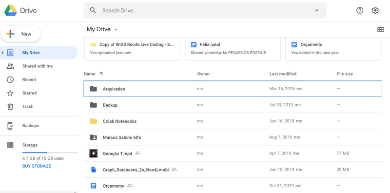

## Data Science live coding!
Visando estimular a nossa participação no próximo Datathon do Women in Data Science (janeiro de 2020) promoveremos sessões semanais de live coding para aprender sobre ferramentas e tópicos de Data Science.  

As ferramentas e tecnologias utilizadas serão Jupyter Notebook no Google Colab, Python como a linguagem de programação, Pandas para manipular os dados e o Scikit-learn para treinar os modelos de Aprendizagem de Máquina.

## Sessões
| Sessão       | Data           | Slides | Link para o Colab  |
| :----------------- | :------------- | :-----| :----- |
| 01      | 14/12/2019 | [Sessão 01](Sess%C3%A3o%2001/WiDS%20Live%20Coding%20-%20Sess%C3%A3o%2001%20%5Bv1.0%5D.pdf) | https://colab.research.google.com/drive/1Gz4YQAJ6YHOOBzq6KCRZvmFr6l4W_-sr|
| 02     | 21/12/2019 | [Sessão 02](Sessão%2002/WiDS%20Live%20Coding%20-%20Sessão%2002%20%5Bv1.0%5D.pdf) | https://colab.research.google.com/drive/1DSa7qd7z35tObSBxthiM__B6MQlS9XKX|
| 03     | 04/01/2020 | [Sessão 03](Sess%C3%A3o%2003/WiDS%20Live%20Coding%20-%20Sess%C3%A3o%2003%20%5Bv1.0%5D.pdf) | https://colab.research.google.com/drive/1jKUDZG4dwW9IPwvNXJ-FwI-9Dr5_F5td|
| 04     | 11/01/2020 | [Sessão 04](Sess%C3%A3o%2004/WiDS%20Live%20Coding%20-%20Sess%C3%A3o%2004%20%5Bv1.0%5D.pdf) | https://colab.research.google.com/drive/1RjtMo80pfy-FziRVPat5DfqLyBeLA0aF|

***

### Como copiar um notebook para sua conta e rodar o código
1. Acessar o link do notebook
2. Ir em File > Save a copy in Drive...

3. Uma nova aba irá abrir com a cópia do notebook salva no seu Google Drive, lá você já pode "dar play" em cada célula para rodar o código
4. Você também pode ver todos os notebooks salvos no seu Drive na pasta Colab Notebooks no https://drive.google.com/

