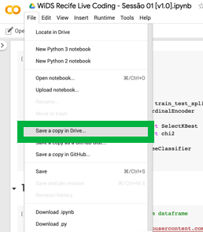

## Live codings de introdução a Data Science! :fire:
Visando estimular a nossa participação no [Wids Datathon edição 2020](https://www.kaggle.com/c/widsdatathon2020/) promoveremos sessões semanais de live coding para aprender sobre ferramentas e tópicos de Data Science.  

As ferramentas e tecnologias utilizadas serão 
* Jupyter Notebook no Google Colab
* Python como a linguagem de programação
* Pandas para manipular os dados
* Scikit-learn para treinar os modelos de Aprendizagem de Máquina

## Sessões
| Sessão       | Data           | Slides | Tópicos | Notebook do código no Colab  | Vídeo no YouTube  |
| :----------------- | :------------- | :-----| :----- | :----- | :----- |
| 01      | 14/12/2019 | [Sessão 01](Sess%C3%A3o%2001/WiDS%20Live%20Coding%20-%20Sess%C3%A3o%2001%20%5Bv1.0%5D.pdf) | O que faz uma cientista de dados, introdução ao pandas e ao scikit-learn | [Link do notebook](https://colab.research.google.com/drive/1Gz4YQAJ6YHOOBzq6KCRZvmFr6l4W_-sr)| [Link do vídeo](https://www.youtube.com/watch?v=56BAP15C0VA) |
| 02     | 21/12/2019 | [Sessão 02](Sessão%2002/WiDS%20Live%20Coding%20-%20Sessão%2002%20%5Bv1.0%5D.pdf) | Explorando dados com o pandas e usando o scikit-learn para selecionar as melhores features para treinar um modelo | [Link do notebook](https://colab.research.google.com/drive/1DSa7qd7z35tObSBxthiM__B6MQlS9XKX) | [Link do vídeo](https://www.youtube.com/watch?v=nBJ8jY8SDPI) |
| 03     | 04/01/2020 | [Sessão 03](Sess%C3%A3o%2003/WiDS%20Live%20Coding%20-%20Sess%C3%A3o%2003%20%5Bv1.0%5D.pdf) | Métricas e formas de avaliar um modelo |[Link do notebook](https://colab.research.google.com/drive/1jKUDZG4dwW9IPwvNXJ-FwI-9Dr5_F5td)| [Link do vídeo](https://www.youtube.com/watch?v=gwoF8yVgqHw) |
| 04     | 11/01/2020 | [Sessão 04](Sess%C3%A3o%2004/WiDS%20Live%20Coding%20-%20Sess%C3%A3o%2004%20%5Bv1.0%5D.pdf) | Viés e variância | [Link do notebook](https://colab.research.google.com/drive/1RjtMo80pfy-FziRVPat5DfqLyBeLA0aF) | [Link do vídeo](https://www.youtube.com/watch?v=ZEvP-EX-l_s) |
| 05     | 18/01/2020 | [Sessão 05](Sess%C3%A3o%2005/WiDS%20Live%20Coding%20-%20Sess%C3%A3o%2005%20%5Bv1.0%5D.pdf) | Visualização de dados com o Seaborn| [Link do notebook](https://colab.research.google.com/drive/1spEkvWgcL0jNKTZ05QpV2fUwRA2MeCOk) | [Link do vídeo](https://www.youtube.com/watch?v=LQVURugO9-k) |
| 06     | 25/01/2020 | [Sessão 06](Sessão%2006/WiDS%20Live%20Coding%20-%20Sessão%2006.pdf) | XGBoost | [Link do notebook](https://colab.research.google.com/drive/1SUMRvmzJkXryS4U75lt7_AnBmovsbK7C) | [Link do vídeo](https://youtu.be/Bgf677u-yc8) |
| 07     | 01/02/2020 | [Sessão 07](Sessão%2007/WiDS%20Live%20Coding%20-%20Sessão%2007.pdf) | Pipelines do Scikit-learn | [Link do notebook](https://colab.research.google.com/drive/1J_BuJNYdRwQXbXrmGr5HF_oIWDn0_JLi) | [Link do vídeo](https://www.youtube.com/watch?v=CJJ9ObvRkCE) |

***

### Como copiar um notebook para sua conta e rodar o código no google colab
1. Acessar o link do notebook
2. Ir em File > Save a copy in Drive...

3. Uma nova aba irá abrir com a cópia do notebook salva no seu Google Drive, lá você já pode "dar play" em cada célula para rodar o código
4. Você também pode ver todos os notebooks salvos no seu Drive na pasta Colab Notebooks no https://drive.google.com/ (pasta com ícone amarelo)
